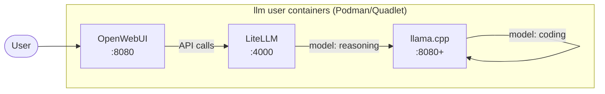

# llm-stack-deploy

Ansible playbook that deploys an LLM inference stack to Ubuntu 26.04+ using rootless Podman containers with Quadlet systemd units. The stack consists of **llama.cpp** (inference, one container per model), **LiteLLM** (OpenAI-compatible API proxy), and **Open WebUI** (chat frontend).

## Architecture



- **OpenWebUI** — `ghcr.io/open-webui/open-webui:latest`, published on port 8080, talks to LiteLLM via `127.0.0.1:4000`
- **LiteLLM** — `ghcr.io/berriai/litellm:main`, published on port 4000, proxies to llama.cpp backends
- **llama.cpp** — one container per model, internal ports (8080+), uses `ghcr.io/ggml-org/llama.cpp:server-rocm` image

All services run as rootless Podman containers under the dedicated `llm` service account with ROCm GPU passthrough, managed via **Quadlet** systemd units (not raw `podman run`).

## Requirements

- Target: Ubuntu 26.04, AMD GPU with ROCm drivers
- Control machine: Python 3.13+ with `uv` installed

## Setup

Bootstrap the control machine and run the playbook (one step):

```bash
./setup.sh
```

Prompts for a target endpoint. Use a hostname/IP for remote (SSH + password) or `localhost` to run directly on the host (sudo password only). Installs Ansible collections from `requirements.yml` before running the playbook.

## Configuration

Edit `vars/main.yml` to add/remove models. Each model entry defines its HuggingFace repo, quantization, context size, and llama.cpp server flags as environment variables and command-line arguments. The `models` list drives:

- Per-model Quadlet container creation (`llamacpp-<model-name>`)
- Per-model named volume for GGUF weights (`llamacpp-<model-name>`)
- LiteLLM proxy configuration (`config.yaml` generated from `templates/litellm-config.yaml.j2`)

## Deploy steps

The playbook (`deploy.yml`) runs these tasks in sequence on `hosts: localhost` with `become: true`:

1. **Common** (`tasks/common.yml`) — Install `podman` + `ufw`, configure firewall (allow SSH, 80, 4000; deny all other incoming), enable APT unattended upgrades with daily package lists and weekly autoclean, configure journald disk limit (1G)
2. **ROCm** (`tasks/rocm.yml`) — Install `rocm` apt package, set TTM pages limit via `/etc/modprobe.d/ttm.conf`
3. **Service Account** (`tasks/service-account.yml`) — Create `llm` user with `render`/`video` groups, enable systemd lingering, configure `XDG_RUNTIME_DIR` via `environment.d`
4. **llama.cpp** (`tasks/llamacpp.yml`) — Create Quadlet containers for each model with GPU device passthrough (`/dev/dri`, `/dev/kfd`), start systemd units
5. **LiteLLM** (`tasks/litellm.yml`) — Generate `config.yaml` from Jinja2 template, create Quadlet container, start systemd unit
6. **OpenWebUI** (`tasks/openwebui.yml`) — Create Quadlet container with auth disabled (`WEBUI_AUTH: false`), start systemd unit

## Ansible config

- `ansible.cfg` — Disables host key checking, uses `sudo.ws` as the privilege escalation executable
- `pyproject.toml` — Project definition: Python >=3.13, `ansible-core` dependency
- `requirements.yml` — Ansible collections: `containers.podman` 1.20.1, `community.general` 13.0.1

## Troubleshooting

### Container logs

```bash
sudo -u llm podman logs -f litellm
sudo -u llm podman logs -f openwebui
sudo -u llm podman logs -f llamacpp-qwen-36-reasoning
```

Replace `qwen-36-reasoning` with your actual model name from `vars/main.yml`.

### Container and volume management

```bash
sudo -u llm podman ps
sudo -u llm podman volume ls
sudo -u llm podman volume inspect llamacpp-qwen-36-reasoning
```

### GPU memory

```bash
rocm-smi --showmeminfo vram
```

### Watching model cache warmup

Watch model files grow in the Podman volume:

```bash
sudo -u llm podman run --rm -v llamacpp-qwen-36-reasoning:/data alpine sh -c 'cd /data && find . -name "*.gguf" -exec du -sh {} \; | sort -rh'
```

### Firewall

Check active rules:

```bash
sudo ufw status numbered
```

Only ports 22 (SSH), 80 (OpenWebUI), and 4000 (LiteLLM) are allowed inbound.

### Systemd units (Quadlet)

Each container is managed as a user-level systemd unit:

```bash
sudo -u llm systemctl --user status container-openwebui.service
sudo -u llm systemctl --user status container-litellm.service
sudo -u llm systemctl --user status container-llamacpp-qwen-36-reasoning.service
```

## Design decisions

### llama.cpp per-model containers

Each model runs as its own Podman container with a unique internal port. This provides independent VRAM isolation per model, easier add/remove model workflows, and allows models with different architectures to run simultaneously on the same GPU. LiteLLM routes requests to the correct container based on the requested model name.

### Quadlet-based deployment

Containers are deployed as Podman Quadlet units rather than raw `podman run` commands. Quadlet generates systemd service files automatically, giving each container proper lifecycle management, auto-restart behavior, and integration with `systemctl --user`. The Ansible `containers.podman.podman_container` module with `state: quadlet` handles this.

### Host-provided ROCm

ROCm kernel drivers are installed on the host from upstream AMD repositories. The llama.cpp containers rely on GPU device nodes (`/dev/dri`, `/dev/kfd`) passed through from the host. A TTM pages limit is configured via modprobe to manage VRAM pressure.

### Rootless Podman under service account

All containers run as the `llm` user with systemd lingering enabled. The service account has `render` and `video` group memberships for GPU access. No container runs with elevated privileges.

### LiteLLM as the API layer

OpenWebUI connects to LiteLLM (not directly to llama.cpp). LiteLLM's `config.yaml` is generated from Ansible variables and maps each model name to the corresponding llama.cpp container endpoint. This provides a clean OpenAI-compatible API surface and makes it easy to add new models without changing OpenWebUI configuration.

### Firewall-first networking

UFW is configured deny-all-by-default with explicit allow rules only for SSH (22), OpenWebUI (80), and LiteLLM (4000). Internal container-to-container communication (OpenWebUI -> LiteLLM -> llama.cpp on localhost) is unaffected since it doesn't pass through the firewall.

### Flat playbook, no roles

This is a single-target, non-portable playbook — no Ansible roles, no indirection. One entrypoint (`deploy.yml`) imports task files in sequence.
