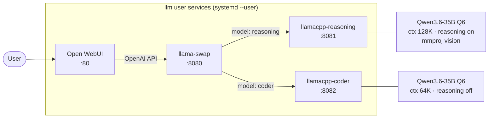

# llm

Ansible playbook that deploys a local AI stack on AMD Strix Halo (gfx1151). Runs two llama.cpp model servers routed by llama-swap, with Open WebUI as a frontend.

## Architecture



Each llama.cpp instance runs one model, fully configured via CLI arguments. llama-swap routes requests to the correct backend based on the `model` field in the API request.

## Requirements

- Target: Ubuntu 26.04, ROCm 7.1 already present
- Control: `uv` installed locally

## Setup

Bootstrap the control machine once:

```
./setup
```

## Deploy

```
./run
```

Prompts for a target endpoint. Use a hostname/IP for remote (SSH + sudo password) or `localhost` to run directly on the host (sudo password only).

## Warm Model Cache

Pre-downloads and loads all enabled models after provisioning. Blocks until complete — expect hours for large GGUFs.

```
uv run --no-lock ansible-playbook warm-cache.yml -i host.example.com,
```

## Troubleshooting

Services run as the `llm` user, so all logs are in the `llm` user journal. To read them, either switch to that user first:

```bash
sudo -u llm XDG_RUNTIME_DIR=/run/user/$(id -u llm) bash
```

Then tail whichever service you need:

```bash
# llama-swap router
journalctl --user -u llamaswap.service -f

# individual model servers
journalctl --user -u llamacpp-reasoning.service -f
journalctl --user -u llamacpp-coder.service -f

# Open WebUI
journalctl --user -u openwebui.service -f
```

Drop `-f` and add `-n 200` to read recent output without tailing.

Alternatively, query from any user by UID without switching:

```bash
journalctl _UID=$(id -u llm) -u llamaswap.service -f
```

### Watching cache warmup

Watch model files grow on disk as they download:

```bash
du -sh /home/llm/.cache/llama.cpp
```

Watch GPU/unified memory fill as models load:

```bash
rocm-smi --showmeminfo vram
```

## Design decisions

**Pre-built llama.cpp** — uses [lemonade-sdk/llamacpp-rocm](https://github.com/lemonade-sdk/llamacpp-rocm) releases rather than compiling from source. Version-stamped at `{{ llamacpp_prefix }}/version`; bump `llamacpp_rocm_tag` in `vars/main.yml` to upgrade.

**llama-swap routing** — [mostlygeek/llama-swap](https://github.com/mostlygeek/llama-swap) proxies the public `:8080` endpoint to two dedicated llama.cpp servers. Each server runs one model with all parameters passed as CLI arguments; there is no preset INI file. Clients address models by name (`"model": "reasoning"` or `"model": "coder"`).

**Two always-on model servers** — both llama.cpp instances stay loaded simultaneously. With 128 GiB unified memory and Q6 quantization (~26 GB per model), both fit alongside their KV caches without swapping.

**Service isolation** — services run as a dedicated `llm` user with lingering enabled, so they survive without a login session. All service management goes through `systemd --user`.

**HSA_OVERRIDE_GFX_VERSION=11.5.1** — required because ROCm reports Strix Halo's iGPU as an unrecognized device; the override forces the gfx1151 codepath.

**Open WebUI via uv** — installed as a uv tool under the service account to keep its Python 3.11 dependency isolated from the system Python.

**TTM pages limit** — set via `modprobe.d` to allow the iGPU to pin the full 128 GiB unified memory as GTT. Value: `33554432` pages × 4 KiB = 128 GiB.
