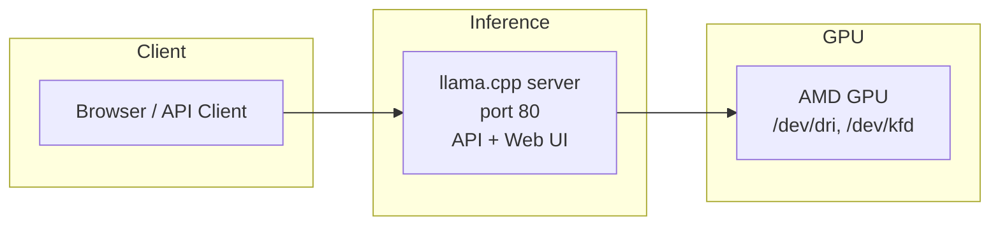
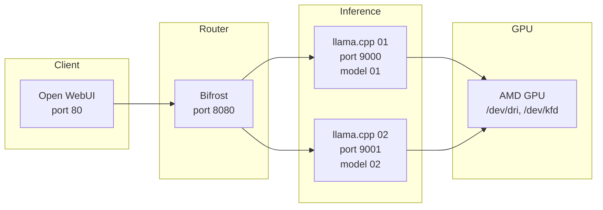

# LLM Stack

A local LLM inference stack for Strix Halo deployed via Ansible on **Ubuntu 26.04 x86_64** with AMD GPU (ROCm). Other distributions, releases, and architectures are not supported by this playbook. Choose one of three deployment modes:

| Setup menu | `llm_stack_mode` | Deployment |
|------------|------------------|------------|
| `1` (setup default) | `standalone-bare-metal` | llama.cpp built from source and installed system-wide, run as a native systemd user service |
| `2` | `standalone-podman` | Single llama.cpp Podman Quadlet container, run as a systemd user service |
| `3` | `modular` | llama.cpp inference containers, Bifrost router, and Open WebUI, all managed by Podman Quadlet user services |

Both standalone modes serve the OpenAI-compatible API and llama.cpp's built-in Web UI. The bare-metal mode does not run the server in Podman.

## Quick Start

### Deploy

```bash
# production — runs setup and deploys to target host
./setup.sh

# development — installs toolchain only (no deployment)
./setup.sh --dev
```

The setup script will prompt for:
- **Target Endpoint** — hostname or IP of the target machine (default: `host.example.com`)
- **Deployment Mode** — `1` for standalone bare metal (default), `2` for standalone Podman, or `3` for the modular stack
- **Target User** — SSH user for remote targets (default: `ubuntu`); local targets use the local connection

### Standalone Modes

A single llama.cpp server runs with a model preset `.ini` file, serving both the OpenAI-compatible API and the built-in chat Web UI:

| Service | Port | Description |
|---------|------|-------------|
| llama.cpp (standalone) | 80 | OpenAI-compatible API + built-in Web UI |

Chat at `http://<target>` in your browser; the API is available at `http://<target>/v1`.

The server is deployed with a set of model presets defined in `roles/inference/defaults/main.yml` (the source of truth for which models are configured at any point in time), but only `models_max` model(s) are resident at once (default `1`): requesting a different model triggers an automatic LRU unload of an idle one. One preset may be marked `load-on-startup` so it downloads and loads at boot; the rest load on demand.

Requests select a model by its registered ID. The router normalizes quantization tags (stripping prefixes like `UD-`), so check the live list rather than guessing: `curl http://<target>/v1/models`.

### Modular Mode

After deployment, the following services are available on the target host:

| Service | Port | Description |
|---------|------|-------------|
| SSH | 22 | Remote Access |
| Open WebUI | 80 | Chat Frontend |
| Bifrost Router | 8080 | OpenAI-Compatible Model Router |
| llama.cpp (inference 01) | 9000 | Model 01 (see `inference_llamacpp` in `roles/inference/defaults/main.yml`) |
| llama.cpp (inference 02) | 9001 | Model 02 (see `inference_llamacpp` in `roles/inference/defaults/main.yml`) |

## Managing the Stack

All modes run as systemd user services under the account configured by `common_service_account.name` (`llm` by default). Bare metal uses a native unit; the Podman modes use generated Quadlet units. Run the commands below in that service account's login session, not as the deployment SSH user.

### Check Service Status

```bash
# either standalone mode (native unit or Podman Quadlet)
systemctl --user status llamacpp-server.service

# modular mode — check a specific service
systemctl --user status llamacpp-inference-01.service
systemctl --user status bifrost.service
systemctl --user status openwebui.service

# list all user services
systemctl --user list-units --type=service
```

### View Logs

```bash
# view logs for a specific service (follow mode)
journalctl --user -u llamacpp-server.service -f
journalctl --user -u llamacpp-inference-01.service -f
journalctl --user -u bifrost.service -f
journalctl --user -u openwebui.service -f

# view recent logs (last 100 lines)
journalctl --user -u llamacpp-inference-01.service -n 100
```

### Restart / Reload

```bash
# restart a container
systemctl --user restart llamacpp-inference-01.service

# stop a container
systemctl --user stop llamacpp-inference-01.service

# start a stopped container
systemctl --user start llamacpp-inference-01.service
```

## Architecture

### Standalone Modes

The request flow is the same for bare metal and Podman; only the runtime differs.



**Data flow:**
1. Requests hit the single llama.cpp server on port 80
2. The built-in router loads/unloads models according to the preset file and routes requests by model ID
3. Inference runs on the AMD GPU via ROCm

**Key components:**
- **Bare metal (`standalone-bare-metal`)** — Builds llama.cpp from `inference_standalone.source_repo` at `source_ref` using ROCm, installs binaries and libraries system-wide, and runs `llama-server` through a native systemd user unit. This is a source build, not a vendor installer.
- **Podman (`standalone-podman`)** — Runs the llama.cpp ROCm image as a single Quadlet container with a named model-cache volume.
- **Both** — Use `--models-preset` with a generated `.ini` file and serve the OpenAI-compatible API and built-in chat Web UI.

### Modular Mode



**Data flow:**
1. Open WebUI sends chat requests to Bifrost's `/v1` endpoint
2. Bifrost routes requests to the appropriate llama.cpp instance based on configuration
3. llama.cpp serves inference requests using the loaded model, offloading to the AMD GPU via ROCm

**Key components:**
- **llama.cpp** — Runs as a Podman quadlet container, serving OpenAI-compatible API endpoints
- **Bifrost** — Model router that presents a unified `/v1` interface and load-balances across inference instances
- **Open WebUI** — Chat frontend that connects to Bifrost as its OpenAI-compatible backend

## Roles Reference

| Role | Tags | Purpose |
|------|------|---------|
| `common` | `common`, `system` | OS updates, packages (podman, tuned, ufw), sysctl, tuned profile, journald limits, base firewall |
| `service-account` | `accounts` | Creates `common_service_account.name` with GPU access groups and enables systemd lingering |
| `system-hardening` | `hardening`, `updates` | Unattended upgrades and reboot configuration |
| `rocm` | `rocm`, `gpu` | ROCm memory configuration (TTM pages limit) |
| `podman-setup` | `podman`, `infrastructure` | Podman modes only: creates `podman_network_name` (default `artificial-intelligence`) |
| `inference` | `inference`, `llamacpp` | Bare metal: source build and native user service. Standalone Podman: single Quadlet with model presets. Modular: one Quadlet per model |
| `router` | `router`, `bifrost` | Modular only: deploys Bifrost router quadlet container with model routing config |
| `chat` | `chat`, `openwebui` | Modular only: deploys Open WebUI quadlet container |

## Configuration

### Deployment Mode

The deployment mode is chosen at the `setup.sh` prompt and passed as `llm_stack_mode`: `standalone-bare-metal` (setup default), `standalone-podman`, or `modular`. Running the playbook directly without this variable defaults to `modular`. To select a mode directly:

```bash
uv run ansible-playbook -i host, playbook.yml \
  --extra-vars "llm_stack_mode=standalone-bare-metal"
```

Preflight assertions reject invalid modes and any target other than Ubuntu 26.04 x86_64 before roles modify the host. These checks also run with normal `--tags` selection via the `always` tag.

> **Switching modes on an already-deployed host** does not remove the previous mode's services. Stop and remove leftover services manually, including native unit files under `~llm/.config/systemd/user/` or Quadlet files under `~llm/.config/containers/systemd/` as appropriate. Both standalone modes use the same service name. Substitute your configured account's home if it is not `llm`.

### Standalone Model Presets

Both standalone modes are configured through a model preset `.ini` file generated from `inference_standalone` in `roles/inference/defaults/main.yml`. See that file for the models, quantizations, and settings deployed at any point in time. The structure looks like this:

```yaml
inference_standalone:
  name: llamacpp-server
  port: 80
  models_max: 1 # max models resident at once; excess are unloaded LRU-style
  cache_path: /root/.cache/huggingface/hub # Podman only: cache backed by a named volume
  global_settings: # shared defaults for all models ([*] section)
    n-gpu-layers: 999
    threads: 32
  presets: # one section per model
    - section: organization/model-GGUF:UD-Q8_K_XL
      settings:
        c: 131072
        hf-repo: organization/model-GGUF:UD-Q8_K_XL # required unless the model is already in the cache
        load-on-startup: "true" # optional: download and load at boot (use for at most one preset)
        temp: 1.0
        top-p: 1.0
```

Each preset must point at its model: set `hf-repo` (downloaded on demand) or `model` (local path) unless the model already exists in the server's cache.

Keys correspond to llama.cpp CLI arguments without leading dashes (see the [llama.cpp model presets documentation](https://github.com/ggml-org/llama.cpp/blob/master/tools/server/README.md#model-presets)). Requests select a model by its registered ID — list them with `curl http://<target>/v1/models`.

Preset-exclusive options are also supported as settings keys, e.g. `load-on-startup: true` downloads and loads the model when the server starts instead of waiting for the first request.

### Customizing Models (modular mode)

Edit `roles/inference/defaults/main.yml` to add or modify inference containers:

```yaml
inference_llamacpp:
  models:
    - name: llamacpp-inference-01
      port: 9000
      environment_variables:
        LLAMA_ARG_ALIAS: my-model
        LLAMA_ARG_HF_REPO: organization/repo:tag
        LLAMA_ARG_N_GPU_LAYERS: 999
      command: --temp 0.7 --top-p 0.9
```

Each model entry creates an independent systemd user service. The `LLAMA_ARG_*` env vars map to llama.cpp CLI flags.

### Router Configuration

Bifrost config is generated from `roles/router/templates/router-config.json.j2` using the same model list from `inference_llamacpp.models`. No manual config editing needed — changes to the model list propagate automatically.

### Key Variables

| Variable | Default | Description |
|----------|---------|-------------|
| `inference_standalone.port` | `80` | Standalone llama.cpp listening port |
| `common_service_account.name` | `llm` | Canonical account for creation, lingering, configuration ownership, and all native/container user services |
| `podman_network_name` | `artificial-intelligence` | Podman network name |
| `router_bifrost.port` | `8080` | Bifrost listening port |
| `chat_openwebui.port` | `80` | Open WebUI listening port |
| `rocm_ttm_pages_limit` | `26214400` | ROCm TTM memory limit in pages |
| `common_tuned_profile` | `throughput-performance` | `tuned` performance profile applied on boot |

Set the account through `common_service_account.name`; there is no separate `svc_account_name` setting. All containers join the network configured by `podman_network_name`.

### Mode-Based Role Selection

Both standalone modes skip the router and chat roles. Bare metal also skips `podman-setup`, although the common role still installs Podman as a base package. Role selection is controlled by `llm_stack_mode`; the previously documented component `*_enabled` opt-outs are not implemented.

### Local Validation

After preparing the development toolchain with `./setup.sh --dev`, run:

```bash
./validate.sh
```

Validation uses the existing environment without syncing dependencies and performs an Ansible syntax check and offline strict production lint; no deployment roles run. Existing lint findings (role names, inference register prefixes, and command `changed_when`) are not suppressed.
