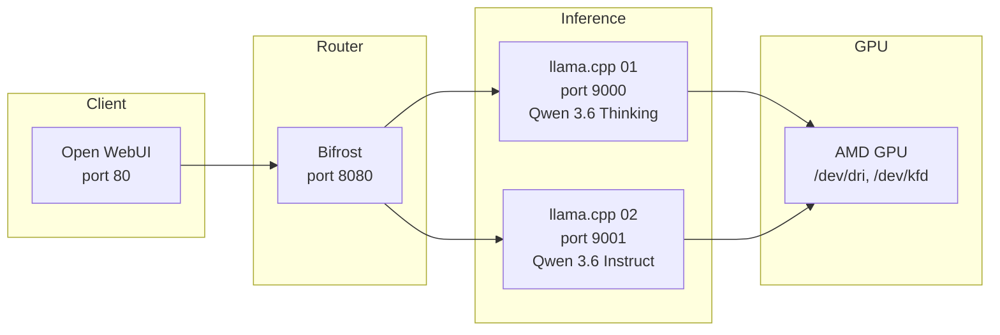

# LLM Stack

A local LLM inference stack for Strix Halo deployed via Ansible on Ubuntu/Debian with AMD GPU (ROCm). Runs llama.cpp inference containers, a Bifrost model router, and Open WebUI chat frontend — all orchestrated through Podman systemd user services.

## Quick Start

### Deploy

```bash
# production — runs setup and deploys to target host
./setup.sh

# development — installs toolchain only (no deployment)
./setup.sh --dev
```

The setup script will prompt for:
- **Target Endpoint** — hostname or IP of the target machine (default: `lisa.home.arpa`)
- **Target User** — SSH user (default: `ubuntu`)

After deployment, the following services are available on the target host:

| Service | Port | Description |
|---------|------|-------------|
| SSH | 22 | Remote Access |
| Open WebUI | 80 | Chat Frontend |
| Bifrost Router | 8080 | OpenAI-Compatible Model Router |
| llama.cpp (inference 01) | 9000 | Qwen 3.6 Thinking Model |
| llama.cpp (inference 02) | 9001 | Qwen 3.6 Instruct Model |

## Managing the Stack

All containers run as systemd user services under the `llm` service account.

### Check Service Status

```bash
# check a specific service
systemctl --user status llamacpp-inference-01.service
systemctl --user status bifrost.service
systemctl --user status openwebui.service

# list all user services
systemctl --user list-units --type=service
```

### View Logs

```bash
# view logs for a specific service (follow mode)
journalctl --user -u llamacpp-inference-01.service -f
journalctl --user -u bifrost.service -f
journalctl --user -u openwebui.service -f

# view recent logs (last 100 lines)
journalctl --user -u llamacpp-inference-01.service -n 100
```

### Restart / Reload

```bash
# restart a container
systemctl --user restart llamacpp-inference-01.service

# stop a container
systemctl --user stop llamacpp-inference-01.service

# start a stopped container
systemctl --user start llamacpp-inference-01.service
```

## Architecture



**Data flow:**
1. Open WebUI sends chat requests to Bifrost's `/v1` endpoint
2. Bifrost routes requests to the appropriate llama.cpp instance based on configuration
3. llama.cpp serves inference requests using the loaded model, offloading to the AMD GPU via ROCm

**Key components:**
- **llama.cpp** — Runs as a Podman quadlet container, serving OpenAI-compatible API endpoints
- **Bifrost** — Model router that presents a unified `/v1` interface and load-balances across inference instances
- **Open WebUI** — Chat frontend that connects to Bifrost as its OpenAI-compatible backend

## Roles Reference

| Role | Tags | Purpose |
|------|------|---------|
| `common` | `common`, `system` | OS updates, packages (podman, ufw), sysctl, journald limits, base firewall |
| `service-account` | `accounts` | Creates the `llm` user with GPU access groups, enables systemd lingering |
| `system-hardening` | `hardening`, `updates` | Unattended upgrades and reboot configuration |
| `rocm` | `rocm`, `gpu` | ROCm memory configuration (TTM pages limit) |
| `podman-setup` | `podman`, `infrastructure` | Creates the `artificial-intelligence` Podman network |
| `inference` | `inference`, `llamacpp` | Deploys llama.cpp quadlet containers for each model |
| `router` | `router`, `bifrost` | Deploys Bifrost router quadlet container with model routing config |
| `chat` | `chat`, `openwebui` | Deploys Open WebUI quadlet container |

## Configuration

### Customizing Models

Edit `roles/inference/defaults/main.yml` to add or modify inference containers:

```yaml
inference_llamacpp:
  models:
    - name: llamacpp-inference-01
      port: 9000
      environment_variables:
        LLAMA_ARG_ALIAS: my-model
        LLAMA_ARG_HF_REPO: organization/repo:tag
        LLAMA_ARG_N_GPU_LAYERS: 999
      command: --temp 0.7 --top-p 0.9
```

Each model entry creates an independent systemd user service. The `LLAMA_ARG_*` env vars map to llama.cpp CLI flags.

### Router Configuration

Bifrost config is generated from `roles/router/templates/router-config.json.j2` using the same model list from `inference_llamacpp.models`. No manual config editing needed — changes to the model list propagate automatically.

### Key Variables

| Variable | Default | Description |
|----------|---------|-------------|
| `common_service_account.name` | `llm` | Service account for running containers |
| `podman_network_name` | `artificial-intelligence` | Podman network name |
| `router_bifrost.port` | `8080` | Bifrost listening port |
| `chat_openwebui.port` | `80` | Open WebUI listening port |
| `rocm_ttm_pages_limit` | `26214400` | ROCm TTM memory limit in pages |
| `sys_hardening_enable_updates` | `true` | Enable unattended upgrades |

### Conditional Deployment

Individual components can be disabled:

```bash
uv run ansible-playbook -i host, playbook.yml \
  --extra-vars "inference_enabled=false router_enabled=false"
```

Toggleable vars: `inference_enabled`, `router_enabled`, `chat_enabled`, `svc_account_enabled`, `sys_hardening_enable_updates`, `rocm_enabled`.
