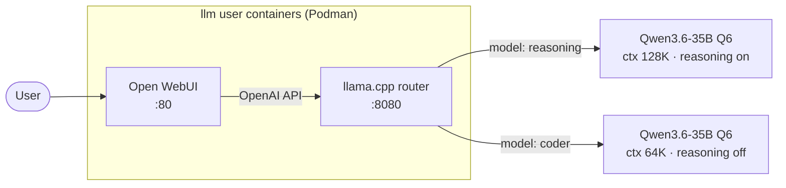

# llm

Ansible playbook that deploys a local AI stack on AMD Strix Halo (gfx1151). Runs llama.cpp in multi-model router mode and Open WebUI as a frontend, both inside rootless Podman containers.

## Architecture



A single `llama-server` instance handles all models via `--models-preset`. Clients address models by name (`"model": "reasoning"` or `"model": "coder"`); the server loads and routes to the matching preset. Both services run as rootless Podman containers under the `llm` user with GPU passthrough (`/dev/dri`, `/dev/kfd`).

## Requirements

- Target: Ubuntu 26.04, Linux 6.1+ kernel with ROCm drivers
- Control: `uv` installed locally

## Setup

Bootstrap the control machine once:

```
./setup
```

## Deploy

```
./run
```

Prompts for a target endpoint. Use a hostname/IP for remote (SSH + sudo password) or `localhost` to run directly on the host (sudo password only).

## Troubleshooting

Containers run as the `llm` user via rootless Podman. To inspect container logs:

```bash
sudo -u llm podman logs -f llamacpp
sudo -u llm podman logs -f openwebui
```

List running containers and volumes:

```bash
sudo -u llm podman ps
sudo -u llm podman volume ls
```

### Watching cache warmup

Watch model files grow in the Podman volume:

```bash
sudo -u llm podman run --rm -v llamacpp-models:/data alpine sh -c 'cd /data && find . -name "*.gguf" -exec du -sh {} \; | sort -rh'
```

Watch GPU/unified memory fill as models load:

```bash
rocm-smi --showmeminfo vram
```

### Updating container images

Re-run the playbook to rebuild the llama.cpp image (tagged to `llamacpp_rocm_tag` in vars). For OpenWebUI, trigger a rebuild:

```bash
sudo -u llm podman auto-update
```

Or manually:

```bash
sudo -u llm podman pull ghcr.io/open-webui/open-webui:latest
sudo -u llm podman stop openwebui && sudo -u llm podman rm openwebui
```

## Design decisions

**llama.cpp in a container** — built from an Ubuntu 26.04-based Dockerfile that downloads and unpacks pre-built ROCm binaries from [lemonade-sdk/llamacpp-rocm](https://github.com/lemonade-sdk/llamacpp-rocm). The release bundles ROCm 7 runtime libraries, so the container is fully self-contained. No host ROCm userspace installation is required — only the kernel DRM/KFD drivers. Bump `llamacpp_rocm_tag` in `vars/main.yml` to upgrade.

**Router mode** — a single `llama-server` instance handles all models via `--models-preset`. Clients address models by name (`"model": "reasoning"`); the server loads and routes to the matching preset. `--models-max` caps concurrent loads.

**Container isolation** — both services run as rootless Podman containers under the dedicated `llm` user with lingering enabled. Container lifecycle is managed declaratively via Ansible's `containers.podman` modules with `restart: unless-stopped`.

**Bundled ROCm** — the llama.cpp release ships ROCm 7 runtime libraries inside the archive. The container does not set `HSA_OVERRIDE_GFX_VERSION` or `LD_LIBRARY_PATH`; ROCm resolves its own dependencies from the bundled `.so` files.

**Open WebUI via official image** — uses the `ghcr.io/open-webui/open-webui:latest` container image. Persistent data is stored in a Podman named volume (`openwebui-data`).

**TTM pages limit** — set via `modprobe.d` to allow the iGPU to pin the full 128 GiB unified memory as GTT. Value: `33554432` pages × 4 KiB = 128 GiB.
