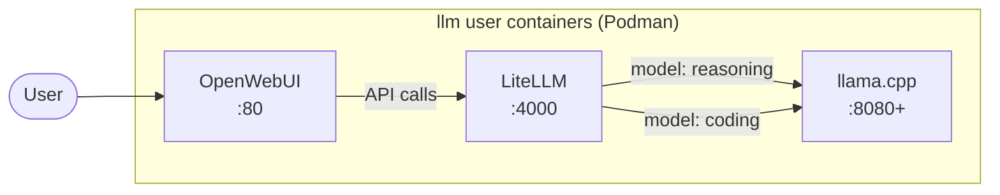

# llm-stack-deploy

Ansible playbook that deploys an LLM inference stack to Ubuntu 26.04 using rootless Podman containers. The stack consists of **llama.cpp** (inference, one container per model), **LiteLLM** (OpenAI-compatible API proxy), and **Open WebUI** (chat frontend). Only OpenWebUI and LiteLLM are exposed externally.

## Architecture



- **OpenWebUI** — `ghcr.io/open-webui/open-web-ui:latest`, exposed on port 80, talks to LiteLLM
- **LiteLLM** — `ghcr.io/berriai/litellm:main`, exposed on port 4000, proxies to llama.cpp backends
- **llama.cpp** — one container per model, internal ports (8080+), uses `ghcr.io/ggml-org/llama.cpp:server-rocm` image

All services run as rootless Podman containers under the dedicated `llm` service account with ROCm GPU passthrough.

## Requirements

- Target: Ubuntu 26.04, AMD GPU with ROCm drivers (installed from upstream AMD repos)
- Control machine: Python 3.13+ with `uv` installed

## Setup

Bootstrap the control machine once:

```bash
./setup.sh
```

## Deploy

```bash
./run
```

Prompts for a target endpoint. Use a hostname/IP for remote (SSH + sudo password) or `localhost` to run directly on the host (sudo password only).

## Configuration

Edit `vars/main.yml` to add/remove models. Each model entry defines its HuggingFace repo, quantization tag, context size, and llama.cpp server flags. The `models` list drives:
- Per-model Podman container creation
- Per-model volume for GGUF weights
- LiteLLM proxy configuration

## Troubleshooting

### Container logs

```bash
sudo -u llm podman logs -f litellm
sudo -u llm podman logs -f openwebui
sudo -u llm podman logs -f llamacpp-model-a
sudo -u llm podman logs -f llamacpp-model-b
```

### Container and volume management

```bash
sudo -u llm podman ps
sudo -u llm podman volume ls
sudo -u llm podman volume inspect llamacpp-models
```

### GPU memory

```bash
rocm-smi --showmeminfo vram
```

### Watching model cache warmup

Watch model files grow in the Podman volume:

```bash
sudo -u llm podman run --rm -v llamacpp-models:/data alpine sh -c 'cd /data && find . -name "*.gguf" -exec du -sh {} \; | sort -rh'
```

## Design decisions

### llama.cpp per-model containers

Each model runs as its own Podman container with a unique internal port. This provides independent VRAM isolation per model, easier add/remove model workflows, and allows models with different architectures to run simultaneously on the same GPU. LiteLLM routes requests to the correct container based on the requested model name.

### Host-provided ROCm

ROCm kernel drivers are installed on the host from upstream AMD repositories. The llama.cpp containers rely on GPU device nodes (`/dev/dri`, `/dev/kfd`) passed through from the host.

### Rootless Podman under service account

All containers run as the `llm` user with systemd lingering enabled. The service account has `render` and `video` group memberships for GPU access. No container runs with elevated privileges.

### Flat playbook, no roles

This is a single-target, non-portable playbook — no Ansible roles, no indirection. One entrypoint (`deploy.yml`) imports task files in sequence.

### LiteLLM as the API layer

OpenWebUI connects to LiteLLM (not directly to llama.cpp). LiteLLM's `config.yaml` is generated from Ansible variables and maps each model name to the corresponding llama.cpp container endpoint. This provides a clean OpenAI-compatible API surface and makes it easy to add new models without changing OpenWebUI configuration.
