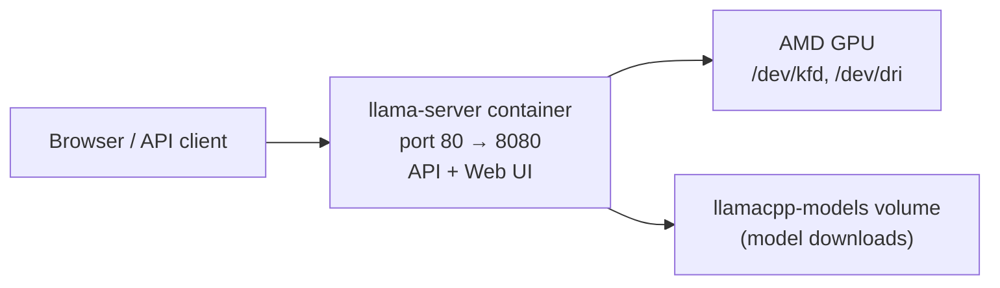

# LLM Stack

A local LLM inference server for AMD Strix Halo (Ryzen AI Max, `gfx1151`), deployed via Ansible on **Ubuntu 26.04 x86_64**. Other distributions, releases, and architectures are not supported.

The playbook builds a llama.cpp `llama-server` image **on the target** against ROCm 10.0 for `gfx1151` only, and runs it as a rootless Podman Quadlet user service. The host carries no ROCm userspace: only the kernel driver, the GTT (TTM) limit, and Podman.

## Quick Start

```bash
# production — installs the toolchain and deploys to the target host
./setup.sh

# development — installs the toolchain only (no deployment)
./setup.sh --dev
```

The setup script prompts for:
- **Target Endpoint** — hostname or IP of the target machine (default: `host.example.com`)
- **Target User** — SSH user for remote targets (default: `ubuntu`); `localhost` uses the local connection

The first run builds the image (20–40 minutes) before the service starts.

### First Boot

The TTM limit is applied through the initramfs, so **reboot after the first run** (the playbook prints a notice whenever the limit changes). Verify:

```bash
cat /sys/module/ttm/parameters/pages_limit   # equals rocm_ttm_pages_limit
```

## Service

| Service | Port | Description |
|---------|------|-------------|
| SSH | 22 | Remote access |
| llama-server | 80 | OpenAI-compatible API (`/v1`) + built-in Web UI (`/`) |

Chat at `http://<target>` in your browser; the API is at `http://<target>/v1`. List the registered model IDs with `curl http://<target>/v1/models`.

Only `models_max` model(s) are resident at once (default `1`); requesting another model unloads an idle one (LRU). There is no API key: run it on a trusted network only.

## Managing the Service

The service runs as a systemd user service under `common_service_account.name` (`llm` by default). Run these in that account's login session (e.g. SSH in as `llm`):

```bash
systemctl --user status llamacpp-server.service
systemctl --user restart llamacpp-server.service
journalctl --user -u llamacpp-server.service -f
podman images localhost/llama-server
```

## Architecture


```mermaid
flowchart LR
    CLIENT["Browser / API client"] --> LLAMA["llama-server container\nport 80 → 8080\nAPI + Web UI"]
    LLAMA --> GPU["AMD GPU\n/dev/kfd, /dev/dri"]
    LLAMA --> CACHE["llamacpp-models volume\n(model downloads)"]
```

1. The Containerfile (`roles/inference/files/Containerfile`) builds llama.cpp at `inference_server.llama_ref` with ROCm's clang for `gpu_target` only, in a builder stage; the runtime stage carries only the ROCm runtime and the binaries.
2. The image is tagged `localhost/llama-server:<llama_ref>-rocm<rocm_version>` and is only built when that tag does not exist yet.
3. The playbook checks that the container sees the GPU (`llama-server --list-devices` must list `gfx1151`), deploys the Quadlet, and waits for `/health`.

## Upgrading and Rolling Back llama.cpp

**Upgrade:** set `inference_server.llama_ref` in `roles/inference/defaults/main.yml` to a new [llama.cpp release tag](https://github.com/ggml-org/llama.cpp/releases), then:

```bash
uv run ansible-playbook -i <host>, playbook.yml --tags inference -u <user> --ask-pass --ask-become-pass
```

A new tag builds a new image and restarts the service; older images stay on the host.

**Roll back:** set `llama_ref` back to the previous tag and rerun. The old image is still local, so nothing is rebuilt. Prune old images as `llm` with `podman image rm localhost/llama-server:<tag>`.

## Roles Reference

| Role | Tags | Purpose |
|------|------|---------|
| `common` | `common`, `system` | APT cache, packages (podman, tuned, ufw), unprivileged port 80, tuned profile, journald limits, base firewall |
| `service_account` | `accounts` | Creates the service account with `render`/`video` groups and enables lingering |
| `system_hardening` | `hardening`, `updates` | Unattended upgrades, Ubuntu security pocket only |
| `rocm` | `rocm`, `gpu` | TTM pages limit + initramfs rebuild (no ROCm packages on the host) |
| `inference` | `inference`, `llamacpp` | Image build, GPU check, preset file, Quadlet, firewall, health check |

## Configuration

### Model Presets

The server is configured through a preset `.ini` generated from `inference_server` in `roles/inference/defaults/main.yml`, which is the source of truth for the configured models:

```yaml
inference_server:
  models_max: 1
  global_settings: # [*] section, shared by all models
    n-gpu-layers: 999
    load-mode: none
  presets: # one section per model
    - section: organization/model-GGUF:UD-Q8_K_XL
      settings:
        c: 131072
        hf-repo: organization/model-GGUF:UD-Q8_K_XL
        load-on-startup: "true" # optional: load at boot (at most one preset)
        temp: 1.0
```

Keys are llama.cpp CLI arguments without leading dashes (see the [model presets documentation](https://github.com/ggml-org/llama.cpp/blob/master/tools/server/README.md#model-presets)). Quote flag values as strings (`"true"`); bare YAML booleans render as `True`. An unknown key stops the server from starting — check `journalctl --user -u llamacpp-server.service`.

### Key Variables

| Variable | Default | Description |
|----------|---------|-------------|
| `inference_server.llama_ref` | `v0.5.0` | llama.cpp git tag built into the image |
| `inference_server.rocm_version` | `10.0` | ROCm version (part of the image tag) |
| `inference_server.gpu_target` | `gfx1151` | GPU architecture compiled for |
| `inference_server.port` | `80` | Host port for the API and Web UI |
| `common_service_account.name` | `llm` | Account that owns and runs the service |
| `rocm_ttm_pages_limit` | `26214400` | TTM pages limit (GPU-addressable system memory) |
| `common_tuned_profile` | `throughput-performance` | `tuned` profile |
| `system_hardening_unattended_reboot` | `false` | Allow unattended reboots at 03:00 |

## Local Validation

After `./setup.sh --dev`:

```bash
./validate.sh
```

Runs an Ansible syntax check and offline strict production lint. To test the image without deploying:

```bash
podman build --build-arg LLAMA_REF=v0.5.0 -t localhost/llama-server:v0.5.0-rocm10.0 roles/inference/files
```
