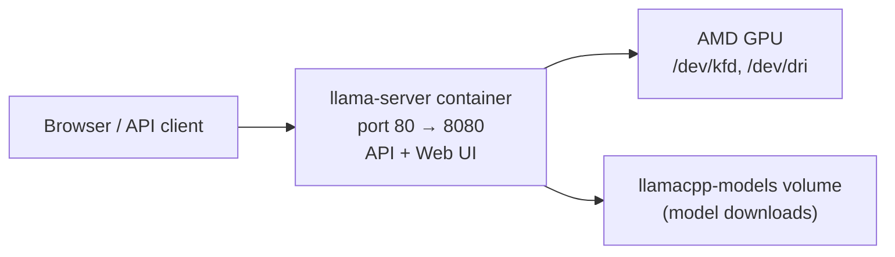

# LLM Stack

A local LLM inference server for AMD Strix Halo (Ryzen AI Max, `gfx1151`), deployed via Ansible on **Ubuntu 26.04 x86_64**. Other distributions, releases, and architectures are not supported.

The playbook builds a llama.cpp `llama-server` image on the target host with ROCm 10.0 for `gfx1151`, and runs it as a rootless Podman Quadlet user service. ROCm is only in the image. The host needs the kernel driver, the TTM memory limit, and Podman.

## Quick Start

```bash
# install the toolchain and deploy to the target host
./setup.sh

# install the toolchain only
./setup.sh --dev
```

The setup script prompts for:
- **Target Endpoint** — hostname or IP of the target machine (default: `host.example.com`)
- **Target User** — SSH user for remote targets (default: `ubuntu`). For `localhost`, the playbook uses a local connection.

Remote targets log in with the SSH password (press Enter at the prompt to use an SSH key instead). Password login needs `sshpass` on the machine running Ansible (`sudo apt install sshpass`). A new host key is accepted on first connect; a changed key is rejected.

The first run builds the image before the service starts. This takes 20–40 minutes.

### First Boot

The TTM limit is set in the initramfs, so **reboot after the first run**. The playbook prints a notice when the limit changes. To check the limit:

```bash
cat /sys/module/ttm/parameters/pages_limit   # equals common_ttm_pages_limit
```

## Service

| Service | Port | Description |
|---------|------|-------------|
| SSH | 22 | Remote access |
| llama-server | 80 | OpenAI-compatible API (`/v1`) + built-in Web UI (`/`) |

Open `http://<target>` in a browser to chat. The API is at `http://<target>/v1`. To list the model IDs, run `curl http://<target>/v1/models`.

At most `inference_models_max` models are loaded at once (default `1`). A request for another model unloads the least recently used idle model. There is no API key, so use it only on a trusted network.

## Managing the Service

The service is a systemd user service of the account `inference_user` (`llm` by default). The account has no password or SSH key. Lingering starts its user manager at boot without a login, and the user manager sets `XDG_RUNTIME_DIR` for the service. You do not need to set it in `.bashrc`.

From the admin account:

```bash
sudo systemctl --user -M llm@ status llamacpp-server.service
sudo systemctl --user -M llm@ restart llamacpp-server.service
sudo journalctl --user -M llm@ -u llamacpp-server.service -f
```

For a shell as `llm`, for example to run `podman`, open a login session:

```bash
sudo machinectl shell llm@
podman images localhost/llama-server
```

`sudo -u llm` and `su - llm` do not open a login session. `XDG_RUNTIME_DIR` is then not set, and `systemctl --user` and `podman` cannot find the user manager or the container state.

## Architecture


```mermaid
flowchart LR
    CLIENT["Browser / API client"] --> LLAMA["llama-server container\nport 80 → 8080\nAPI + Web UI"]
    LLAMA --> GPU["AMD GPU\n/dev/kfd, /dev/dri"]
    LLAMA --> CACHE["llamacpp-models volume\n(model downloads)"]
```

1. `roles/inference/files/Containerfile` has two stages. The builder stage compiles llama.cpp at `inference_llama_ref` for `gfx1151` with ROCm's clang. The runtime stage contains only the ROCm runtime and the llama.cpp binaries.
2. The image tag is `localhost/llama-server:<llama_ref>-rocm10.0`. The playbook builds the image when the tag does not exist or when the Containerfile changed. A rebuild replaces the existing tag.
3. The playbook checks that the container can use the GPU (`llama-server --list-devices` must list `ROCm0`), deploys the Quadlet, and waits until `/health` returns 200.

## Upgrading and Rolling Back llama.cpp

**Upgrade:** set `inference_llama_ref` in `roles/inference/defaults/main.yml` to a new [llama.cpp release tag](https://github.com/ggml-org/llama.cpp/releases), then:

```bash
uv run ansible-playbook -i <host>, playbook.yml --tags inference -u <user> --ask-pass --ask-become-pass
# or, without editing the file:
uv run ansible-playbook -i <host>, playbook.yml --tags inference -u <user> --ask-pass --ask-become-pass -e inference_llama_ref=<tag>
```

A new tag builds a new image and restarts the service. Older images stay on the host.

**Roll back:** set `inference_llama_ref` to the previous tag and run the playbook again. The old image is still on the host, so no build runs, unless the Containerfile changed since that image was built.

**Disk:** each build leaves an untagged builder image that contains the ROCm toolchain (several GB). In `sudo machinectl shell llm@`, remove it with `podman image prune -f`, and remove old tags with `podman image rm localhost/llama-server:<tag>`.

## Roles Reference

| Role | Tags | Purpose |
|------|------|---------|
| `common` | `common` | Packages, tuned profile, journald limits, TTM pages limit and initramfs rebuild (no ROCm on the host), unattended security upgrades, base firewall |
| `inference` | `inference` | Service account (`render`/`video`, lingering), unprivileged port, image build, GPU check, preset file, Quadlet, firewall, health check |

## Configuration

### Model Presets

The playbook generates the server's preset `.ini` file from `inference_presets` in `roles/inference/defaults/main.yml`. Each key is an `.ini` section: `"*"` applies to all models, every other key is one model:

```yaml
inference_presets:
  "*":
    n-gpu-layers: 999
    load-mode: none
  "organization/model-GGUF:UD-Q8_K_XL":
    c: 131072
    hf-repo: organization/model-GGUF:UD-Q8_K_XL
    load-on-startup: true # optional: load at startup (use on one preset at most)
    temp: 1.0
```

Keys are llama.cpp CLI arguments without leading dashes (see the [model presets documentation](https://github.com/ggml-org/llama.cpp/blob/master/tools/server/README.md#model-presets)). YAML booleans are written as `true`/`false`. The server does not start if a key is unknown. Check the log with `sudo journalctl --user -M llm@ -u llamacpp-server.service`.

### Key Variables

| Variable | Default | Description |
|----------|---------|-------------|
| `inference_llama_ref` | `v0.5.0` | llama.cpp git tag built into the image |
| `inference_port` | `80` | Host port for the API and Web UI |
| `inference_models_max` | `1` | Models loaded at once |
| `inference_user` | `llm` | Account that owns and runs the service |
| `common_ttm_pages_limit` | `26214400` | TTM pages limit (GPU-addressable system memory) |
| `common_tuned_profile` | `throughput-performance` | `tuned` profile |
| `common_unattended_reboot` | `false` | Allow unattended reboots at 03:00 |

## Local Validation

After `./setup.sh --dev`:

```bash
./validate.sh
```

This runs an Ansible syntax check and `ansible-lint` with the production profile. To test the image build without deploying:

```bash
podman build --build-arg LLAMA_REF=v0.5.0 -t localhost/llama-server:v0.5.0-rocm10.0 roles/inference/files
```

The playbook does not reuse an image built this way: it rebuilds it, because the image lacks the Containerfile hash label that the playbook checks.
